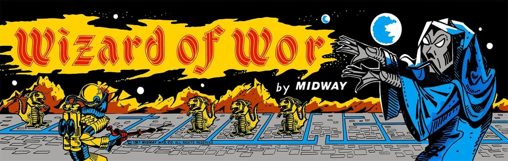
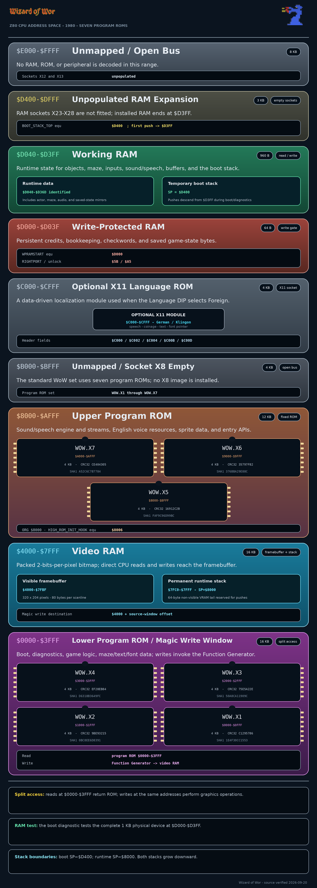

# Wizard of Wor

This project reconstructs the native Z80 source for **Wizard of Wor**, developed
at Dave Nutting Associates and released by Midway Manufacturing in 1980. The
source builds the seven populated 4 KB program ROMs byte for byte and packages
them for MAME.



Wizard of Wor is a one- or two-player maze shooter. Two Worriors can play at the
same time, cooperating against the monsters or competing for points while they
clear a sequence of increasingly difficult dungeons. Burwors, Garwors, and
Thorwors fill the maze; later phases add Worluk and the Wizard himself. A radar
at the bottom of the screen continues to track enemies after they become
invisible.

The game runs on Dave Nutting Associates' Astrocade-derived arcade hardware: a
Zilog Z80, a 16 KB packed-pixel framebuffer, the Astrocade Function Generator
and pattern board, two Astrocade custom I/O chips with programmable sound
generators, and a Votrax SC-01 speech synthesizer. An optional 4 KB X11 ROM
supplies alternate text, coinage, font, and speech-table data for foreign sets.

The game is native Z80. Its foreground flow is organized as a game-specific
threaded command stream whose entries select ordinary Z80 handlers and their
inline operands. Interrupt handlers, graphics, sound, speech, input, service
tests, and board control are also implemented in native Z80.

## Credits

Original game credits commonly identify:

- Dave Nutting Associates — development
- Dave Nutting and Tom McHugh — game design
- Midway Manufacturing, a Bally company — arcade manufacture and release

This repository preserves and documents the program through a buildable source
reconstruction, including the resident English resources and optional X11
language projects.

|  |  |
| --- | --- |
| [ROM organization](#rom-organization) | Seven populated 4 KB program ROMs reproduce the verified reference hashes; X8 is unpopulated. |
| [Build](#build) | zmac assembles the combined image, splits the populated CPU ranges, and packages a MAME archive. |
| [Memory map](#memory-map) | ROM, split-access video, protected RAM, work RAM, the empty X8 window, and optional X11 are mapped across the complete 64 KB address space. |
| [RAM and I/O](#ram-and-io-ownership) | Actor state, maze data, persistent state, dual sound engines, the speech queue, and both stack anchors are identified. |
| [Sound](#sound-architecture) | Both Astrocade sound generators, their work-RAM engines, request bytes, and ROM stream interpreter are documented. |
| [Speech](#speech-architecture) | The 79 English fragments, 80 phrases, SC-01 playback path, queue, and X11 table contract are documented. |
| [Reverse engineering](#reverse-engineering-status) | Reproducible areas and remaining source-analysis work are summarized. |

## ROM organization

The standard set contains seven populated 4 KB program ROMs. The verified ROM
identity is:

| File | CPU range | Size | CRC32 | SHA1 |
| --- | ---: | ---: | --- | --- |
| `wow.x1` | `$0000-$0FFF` | 4 KB | `c1295786` | `1e4f30cc15537aed6603b4e664e6e60f4bccb5c5` |
| `wow.x2` | `$1000-$1FFF` | 4 KB | `9be93215` | `0bc8ee6d8391104eb217b612f32856b105946682` |
| `wow.x3` | `$2000-$2FFF` | 4 KB | `75e5a22e` | `50a8ca11909ce49412c47de4da69e39a083ce5af` |
| `wow.x4` | `$3000-$3FFF` | 4 KB | `ef28eb84` | `d6318b3649fccafc2d0a05e5530e88819d299356` |
| `wow.x5` | `$8000-$8FFF` | 4 KB | `16912c2b` | `faf9c96d99bc111c5f1618f6863f22fd9269027b` |
| `wow.x6` | `$9000-$9FFF` | 4 KB | `35797f82` | `376bba29e88c16d95438fa996913b76581df0937` |
| `wow.x7` | `$A000-$AFFF` | 4 KB | `ce404305` | `a52c6c7b77842f25c79515460be6b7ed959b5edb` |

The low four ROMs occupy `$0000-$3FFF`. The high three occupy
`$8000-$AFFF`; they contain later game code, graphics and tables, plus the
resident sound and speech subsystem. The `$4000-$7FFF` gap is video RAM and is
never packaged as ROM.

Socket X8, mapped at `$B000-$BFFF`, is not populated in the standard game. The
boot checksum loop explicitly skips it. A generated all-`$FF` `wow.x8` file is
therefore a placeholder, not an eighth program ROM.

## Game structure

The normal game loop is driven by a native command stream selected for attract
or active play. Its handlers initialize the dungeon, expand a compact maze
record into work RAM, create the two player records and six enemy records,
service timed events, draw status information, and advance the dungeon state.

The main progression tracked by the source is:

1. Build and draw the selected maze.
2. Populate it with Burwors, then introduce the faster and more dangerous
   Garwor and Thorwor enemies as the dungeon advances.
3. Let Worluk enter after the regular monsters are cleared. Destroying it earns
   double scoring in the next dungeon; allowing it to escape follows a separate
   result path.
4. Give the Wizard of Wor an opportunity to appear as the final adversary.
5. Advance the dungeon number and select a new maze, with later Arena, Worlord,
   and Pit behavior controlled by the progression state.

`Dungeon_Number` at `$D302`, `Dungeon_Class` at `$D350`, `Maze_Index` at
`$D318`, and the maze-selection flags beginning at `$D354` are the principal
progression variables. The repository still treats some late-game selection
and difficulty rules as active reverse-engineering work rather than presenting
guesses as settled behavior.

## Project layout

| Path | Contents |
| --- | --- |
| `src/wow_disassembly.asm` | Native Z80 program, command streams, English text, graphics, sound, speech, and resident data |
| `src/wow_equates.include` | Hardware ports, memory map, RAM symbols, record layouts, and game constants |
| `src/german/GERMAN_X11.asm` | Optional German X11 data ROM |
| `src/klingon/KLINGON_X11.asm` | Experimental Klingon X11 data ROM |
| `build.sh` | Linux assembly, seven-ROM splitting, and packaging workflow |
| `build.bat` | Windows assembly, seven-ROM splitting, and packaging workflow |
| `docs/SOUND_MAP.md` | Dual Astrocade sound hardware, engine records, bytecode, requests, and event map |
| `docs/SPEECH_MAP.md` | English fragment and phrase inventories, queue, SC-01 playback, and X11 ABI |
| `docs/Wizard_of_Wor_ROM_and_Memory_Map.pdf` | Board-oriented ROM and memory-map reference |
| `docs/Z80_Coding_Style.md` | Source layout, naming, and comment conventions |
| `tools/Lua/` | MAME Lua sound and speech browsers used for focused validation |
| `images/wow-marquee.webp` | Marquee displayed by this README |
| `images/wow-memory-map.png` | Verified 64 KB Z80 CPU memory map |

Generated assembly output is written below `src/zout/`; generated ROM members
and ZIP archives are written below `roms/`.

## Build

The source is built with Bruce Norskog's **zmac 1.3**. The Linux script also
supports a modern zmac command line. Both scripts resolve the assembler from
`ZMAC`, the repository's `tools/` directory, or `PATH`.

- [zmac 1.3 for Windows](https://ballyalley.com/ml/ml_tools/Zmac13_win32.zip)
- [zmac for Linux](https://ballyalley.com/ml/ml_tools/zmac-linux.zip)

For a speech-capable archive, place the SC-01 internal ROM at
`roms/sc01.bin`. It is a device ROM and is not part of this reconstructed
program source. The Windows build also accepts `roms/original/sc01.bin` as a
fallback. A build without either file continues but does not package speech.

Linux:

```sh
./build.sh
```

To select an assembler explicitly:

```sh
ZMAC=/path/to/zmac ./build.sh
```

Windows 10/11:

```bat
build.bat
```

```bat
set ZMAC=C:\path\to\zmac.exe
build.bat
```

Both build scripts perform these steps:

1. Assemble `src/wow_disassembly.asm` into a combined CPU image and listing.
2. Extract the seven populated 4 KB ranges, skipping video RAM and the empty X8
   socket.
3. Package `wow.x1` through `wow.x7` and `sc01.bin`, when present, as
   `roms/wow.zip`.

Generated English-set files:

```text
src/zout/wow_disassembly.cim       # Linux combined image
src/zout/wow_disassembly.hex       # Windows combined image
src/zout/wow_disassembly.lst
roms/wow.x1
roms/wow.x2
roms/wow.x3
roms/wow.x4
roms/wow.x5
roms/wow.x6
roms/wow.x7
roms/wow.zip
```

## Run in MAME

Keep the generated archive in `roms/` and point MAME at that directory:

```sh
mame wow -rompath roms
```

For a windowed run that skips the game-information screen:

```sh
mame -window -skip_gameinfo -rompath roms wow
```

The build reproduces the standard program members listed above. MAME may still
report a missing speech device ROM if `sc01.bin` was not included.

## Optional ROMs

The X11 socket maps one 4 KB data ROM at `$C000-$CFFF`. It is not an executable
program overlay. In foreign mode the resident program reads an X11 header that
provides:

| X11 address | Meaning |
| ---: | --- |
| `$C000-$C001` | Speech-fragment pointer-table address |
| `$C002-$C003` | Speech-phrase pointer-table address |
| `$C004-$C009` | Coinage values |
| `$C00A` | Expected diagnostic checksum |
| `$C00B-$C00C` | Alternate-font pointer |
| `$C00D...` | Localized text records |

The Language DIP switch is port `$13` bit 3: set selects resident English
resources; clear selects the X11 tables. Text, speech, coinage, font selection,
and the ROM diagnostic all honor that selection.

Build the German set:

```sh
./build.sh --german
```

Build the experimental Klingon set:

```sh
./build.sh --klingon
```

The options are mutually exclusive and are also accepted by `build.bat`. The
German build creates `roms/german.x11` and `roms/wowg.zip`. The Klingon build
creates `roms/klingon.x11`, a project archive named `roms/wowk.zip`, and a
MAME-compatible `roms/wowg.zip` alias whose X11 member is named
`german.x11`.

Stock MAME runs either foreign-data archive through its `wowg` system:

```sh
mame wowg -rompath roms
```

The most recent German or Klingon build determines the contents of
`roms/wowg.zip`.

## Memory map



| CPU range | Size | Read behavior | Write behavior |
| --- | ---: | --- | --- |
| `$0000-$3FFF` | 16 KB | Program ROM X1-X4 | Function Generator/Magic writes target video RAM at `$4000 + address` |
| `$4000-$7FFF` | 16 KB | Direct video RAM | Direct video RAM |
| `$8000-$AFFF` | 12 KB | Program ROM X5-X7 | ROM; writes have no normal program-storage role |
| `$B000-$BFFF` | 4 KB | Empty X8 socket/open bus | Unmapped |
| `$C000-$CFFF` | 4 KB | Optional X11 data ROM; open bus when absent | ROM |
| `$D000-$D03F` | 64 bytes | Protected persistent RAM | Requires the `$A5` write-enable sequence through port `$5B` |
| `$D040-$D3FF` | 960 bytes | Work RAM | Work RAM |
| `$D400-$DFFF` | 3 KB | Unpopulated RAM expansion sockets | Unmapped on a standard board |
| `$E000-$FFFF` | 8 KB | Open bus | Unmapped |

The visible 320-by-204 framebuffer occupies `$4000-$7FBF` at 80 bytes per
scanline. `$7FC0-$7FFF` is the non-visible video-RAM tail used as the permanent
runtime stack margin. `SP` is initialized to `$8000`, so the first push writes
at `$7FFF`. Boot and diagnostics temporarily set `SP` to `$D400`, placing that
stack below it in work RAM.

Reads and writes at `$0000-$3FFF` intentionally have different destinations.
Reads fetch low program ROM; writes are intercepted by the Function Generator
and modify the corresponding framebuffer byte at `$4000-$7FFF` according to
the current Magic control state. The ROM devices themselves are never written.

## RAM and I/O ownership

### Known RAM ranges

| RAM range | Ownership |
| --- | --- |
| `$D000-$D03F` | Write-protected persistent state, integrity words, bookkeeping, and credits; `Credits` is `$D03C` |
| `$D040-$D053` | Timers, scheduler state, and early game workspace |
| `$D054-$D073` | Player 1 actor record |
| `$D074-$D093` | Player 2 actor record |
| `$D094-$D177` | Six enemy actor records followed by the maze-expansion prebase |
| `$D178-$D1B9` | 66-byte expanded maze cell map |
| `$D1BA-$D23F` | Result effects, palette state, diagnostic/input snapshots, display state, and other game workspace |
| `$D240-$D243` | Four sound-request bytes |
| `$D244-$D245` | Sound-service gate and speech-active flag |
| `$D246-$D281` | Primary sound engine: six modulator slots and one engine record |
| `$D282-$D2BD` | Secondary sound engine: six modulator slots and one engine record |
| `$D2BE-$D2D5` | Eight-record speech queue, active phoneme state, and queue pointers |
| `$D2D6-$D2FF` | Remaining audio/game workspace; not every byte has a final semantic name |
| `$D300-$D323` | Fast mirror of the persistent player and progression state |
| `$D324-$D36D` | Coin, DIP, RNG, dungeon, maze-selection, and extended game state |
| `$D36E-$D3FF` | General workspace and temporary boot-stack headroom; ownership is not fully resolved |

The source deliberately distinguishes Z80 memory addresses from Z80 I/O port
numbers. For example, `$D270` is a work-RAM engine record, while port `$18` is
the hardware block-output path for the primary sound generator.

## I/O ports and video hardware

Many port numbers are direction-sensitive. A read and a write at the same
numeric address can reach different hardware.

| Port | Direction | Function |
| ---: | --- | --- |
| `$00-$07` | OUT | Eight color registers, four for each side of the horizontal color boundary |
| `$08` | OUT / IN | Consumer/commercial video mode / intercept and collision status |
| `$09` | OUT | Horizontal color boundary and background control |
| `$0A` | OUT | Vertical blanking line; WoW programs 204 scanlines |
| `$0B` | OUT | Color-register block output |
| `$0C` | OUT | Magic/Function Generator control |
| `$0D` | OUT | Interrupt feedback and IM2 vector-low selection |
| `$0E` | OUT | Interrupt source and mode control |
| `$0F` | OUT | Scanline interrupt compare |
| `$10` | IN / OUT | System, coin, start, and service inputs / primary master oscillator |
| `$11` | IN / OUT | Player 2 or cocktail controls / primary Tone A |
| `$12` | IN / OUT | Player 1 controls and SC-01 ready on bit 7 / primary Tone B |
| `$13` | IN / OUT | DIP switches / primary Tone C |
| `$14-$17` | OUT | Primary vibrato, volume, and noise registers |
| `$15` | special IN form | Board control latch selected by the value in `A` |
| `$17` | special IN form | SC-01 command strobe, with the command supplied in `B` |
| `$18` | OUT | Primary eight-register sound block transfer |
| `$19` | OUT | Expand-mode color definition |
| `$50-$57` | OUT | Secondary sound-generator registers |
| `$58` | OUT | Secondary eight-register sound block transfer |
| `$5B` | OUT | Protected-RAM write enable; output `$A5` before each protected write |
| `$78-$7E` | OUT / status | Pattern-board source, destination, mode, width, height, and status registers |

The Magic register at `$0C` selects rotation, expansion, OR, XOR, horizontal
flop, and vertical flip behavior for writes through `$0000-$3FFF`. The pattern
board provides a second graphics path for rectangular copies and fills. It uses
ports `$78-$7E` for source, destination, mode, dimensions, and transfer state.

## Cabinet controls and language option

The program treats the cabinet inputs as active-low:

- ports `$11` and `$12`: four joystick directions plus left and right fire
  switches for player 2 and player 1 respectively
- port `$10` bits 0-2: three coin switches
- port `$10` bit 3: service/diagnostic switch
- port `$10` bit 4: slam/tilt switch
- port `$10` bits 5-6: one-player and two-player start buttons
- port `$13`: eight DIP switches, including Language on bit 3, starting lives on
  bit 4, bonus-life timing on bit 5, free play on bit 6, and attract sound on
  bit 7

The source also samples port `$10` bit 7 for cabinet-orientation-dependent text
placement. The diagnostic screen exercises both joysticks, both fire switches
per player, the starts, all three coin inputs, slam, and all eight DIP switches.

## Sound architecture

Non-speech sound is synthesized in real time by the two Astrocade custom I/O
chips. The Z80 interprets ROM streams that update tone, volume, vibrato, noise,
wait, and modulation state; the periodic service then transfers an eight-byte
register image to the selected chip.

| Engine | Modulator slots | Engine record | Hardware ports |
| --- | ---: | ---: | ---: |
| Primary | `$D246-$D26F` | `$D270-$D281` | `$10-$18` |
| Secondary | `$D282-$D2AB` | `$D2AC-$D2BD` | `$50-$58` |

Each engine occupies 60 bytes: six 7-byte modulator slots followed by an
18-byte engine record. The record stores the block port, current stream
pointer, priority, hardware-register image, wait state, service guard, and
ready state. A shared routine services either engine by changing the `IY` base.

Gameplay posts sound events through four request bytes at `$D240-$D243`.
High-ROM entry `$8003` consumes requests and installs the selected streams;
entry `$8000` performs periodic sound and speech service. The complete opcode,
request, stream, producer, and RAM-field analysis is in
[`docs/SOUND_MAP.md`](docs/SOUND_MAP.md).

## Speech architecture

Speech uses a Votrax SC-01. The resident English data contains 79 fragment
records, IDs `$00-$4E`, and 80 phrase records, IDs `$00-$4F`. A phrase is a
short list of fragment IDs; each fragment is an encoded stream of SC-01
commands.

The playback path is:

1. Gameplay calls the high-ROM speech request entry at `$8009`.
2. `Queue_Speech_Request` resolves the phrase through the resident English
   tables or the selected X11 tables.
3. Fragment pointers are placed in the eight-record queue at `$D2BE-$D2CD`.
4. The periodic service polls SC-01 ready on port `$12` bit 7.
5. The next decoded phoneme command is strobed through the special port `$17`
   access.

Active playback state occupies `$D2CE-$D2D5`: phoneme pointer, remaining count,
inflection state, and queue write/read pointers. Encoded command bits 0-5 select
the phoneme, bit 6 passes through directly, and bit 7 participates in WoW's
differential inflection state.

The complete fragment and phrase inventories, queue validation, X11
requirements, and emulator regression notes are in
[`docs/SPEECH_MAP.md`](docs/SPEECH_MAP.md).

## Service diagnostics

The service path is part of the resident low-ROM program and verifies the board
in a hardware-aware order:

1. A stackless walking-bit test fills and checks all video RAM at
   `$4000-$7FFF`.
2. A three-pass static-RAM test covers the full physical 1 KB RAM device at
   `$D000-$D3FF`, including protected RAM.
3. A modulo-256 checksum checks the seven resident program ROMs. Foreign mode
   adds the X11 ROM; the loop skips video RAM and the empty X8 socket.
4. The switch screen reports player controls, both fire switches, starts, coin
   inputs, slam, and all DIP switches.
5. Pressing both start buttons advances to the crosshatch/alignment grid.

The high-ROM periodic service also contains an attract-mode service-switch
sound/input diagnostic. It drives both sound generators from live cabinet and
DIP input patterns while continuing to service the speech queue.

## Reverse-engineering status

| Area | Status |
| --- | --- |
| Reproducible ROM build | Verified for the seven populated program ROMs listed above |
| CPU memory map | Complete at board-window level, including split-access low ROM, video RAM, protected/work RAM, empty X8, and optional X11 |
| Boot and diagnostics | Major paths named and documented, including VRAM, RAM, ROM, input, sound, and crosshatch tests |
| Input and cabinet control | Port roles and active-low control paths identified; several shared-port details remain documented at hardware level rather than by schematic signal name |
| Actor and maze state | Player/enemy records, compact maze selection, and 66-byte expanded maze map identified |
| Sound | Dual engines, request banks, bytecode, work RAM, and event producers substantially mapped in `docs/SOUND_MAP.md` |
| Speech | Resident fragments and phrases, queue, SC-01 playback, and X11 ABI mapped in `docs/SPEECH_MAP.md` |
| Progression and game flow | Main command streams and core dungeon state identified; some late-game selection and difficulty rules still use legacy labels |
| Graphics and remaining data | Major framebuffer, Function Generator, pattern-board, sprite, font, and palette paths identified; fine-grained data naming remains in progress |

Unresolved addresses retain neutral labels instead of speculative names. New
semantic names should be backed by concrete call sites, data flow, hardware
behavior, or emulator traces.

## References

### Original game and project documentation

- [`docs/Wizard_of_Wor_ROM_and_Memory_Map.pdf`](docs/Wizard_of_Wor_ROM_and_Memory_Map.pdf) — repository ROM and board memory-map reference
- [Wizard of Wor](https://en.wikipedia.org/wiki/Wizard_of_Wor) — release history, credited designers, and gameplay overview

### Emulator source

- [MAME source repository](https://github.com/mamedev/mame) — current machine definition, ROM metadata, Astrocade devices, SC-01 emulation, and input configuration
- [MAME project](https://www.mamedev.org/) — emulator releases and documentation

### Hardware and development tools

- [Bally Alley arcade documentation](https://ballyalley.com/documentation/Arcade_Games/Arcade_Games.html) — Astrocade-derived arcade hardware references and manuals
- [Bally Alley machine-language tools](https://ballyalley.com/ml/ml_tools/) — archived zmac downloads and related tools
- [`docs/SOUND_MAP.md`](docs/SOUND_MAP.md) — repository sound-hardware and software-engine analysis
- [`docs/SPEECH_MAP.md`](docs/SPEECH_MAP.md) — repository speech-data and SC-01 playback analysis
